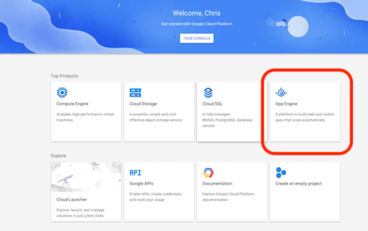
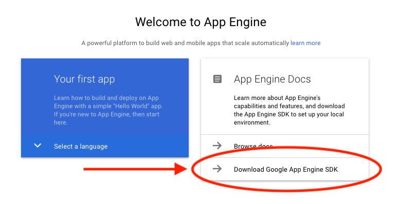
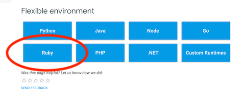
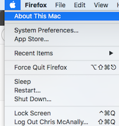
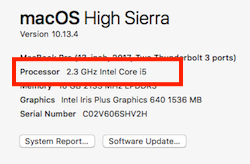
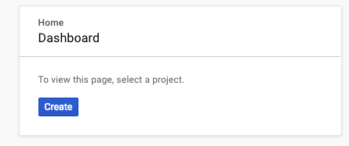
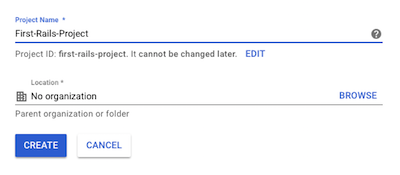

# Deploying to Google App Engine Flexible Environment
In this lecture we will learn about an alternative option for deploying back-end web applications.

## Learning Goals
By the end of this lesson you should be:
- Able to explain what the _Google Cloud_ and _Google App Engine_ are
- Able to install and use the Google Cloud Command-line tools
- Deploy a Rails application to the App Engine

## Overview

The Google Cloud is a collection of services Google provides which allow developers to use Google infrastructure (servers, networking equipment, storage, etc) to host applications, data and services.  Like Amazon, Google operates a number of datacenters around the world and makes the infrastructure available for rent to deploy application.  It also provides debugging and database tools for your application in production.

This lesson will focus on deploying a Rails application on the Google App Engine.


### What is App Engine?

Google App Engine is a web framework and cloud computing platform offered by Google.  It is roughly analogous to Heroku or Amazon Elastic Beanstalk.  It is designed to allow developers to rapidly deploy web applications and APIs to the Google Cloud.  The platform is free up to a certain level resources.


### What is Flexible Environment?

The Google App Engine Flexible Environment automatically scales up resources for a deployed service and balances incoming requests.  There are a lot of advanced features you can use to customize the language, operating system and performance, but we will not go into that here.  The key is that App Engine can automatically adjust the infrastructure supporting your application to keep it working through spikes in demand and scale down when demand decreases.


#### Load balancers

#### Web application servers

#### Database

#### Heroku
Now that we've taken a pretty significant tour through the different systems that the Flexible Environment uses to manage our deployments, lets take a look at how this differs with Heroku.


## Live Demonstration
### Get the application code
Clone the repository from https://github.com/adagold/gcp-app-engine-rails (there is no need to fork this).

### Google Cloud Account

To use the Google Cloud Platform, first

1.  First go to the [Google Cloud Platform Console](https://console.cloud.google.com/) and log in with any Google account.  You may need to create an account.
  - You will need to accept the platform license.
  - You will also need to set up a payment method.  **Note:** you will receive $300 in credits and will not be charged unless you exceed that amount.
2.  Then click on the `App Engine` block, it may look like this:



3.  Next click on `Download Google App Engine SDK`



4.  You will need to go to the **Flexible environment** and pick the **Ruby** environment.



5.  Then Download the SDK (You should already have the other requirements).

### Install the Google Cloud SDK

To install the Google Cloud Tools you need to select either the 32-bit or 64-bit versions.  If you do not know click on the Apple Icon and select **About This Mac**.  If your processor is Core 2 Duo, you need the 32-bit version, otherwise select the 64-bit version.





After you download the tools, double click on them in finder to extract them.

Then cd into the folder you extracted the files to and enter:

```bash
./google-cloud-sdk/install.sh
```

Then initialize the SDK:

```bash
./google-cloud-sdk/bin/gcloud init
```

Follow the directions to install the tools.

Lastly **Exit the terminal and open a new terminal window**.

### Create an App Engine Project

Next we need to create a GCP project to deploy to.  Either click on the console link at the top-right of the browser or go to [https://console.cloud.google.com](https://console.cloud.google.com).

Then create a new Project.



You can choose any name and leave the organization blank.



It may take a few minutes to create the project and you will be able to find it in a drop-down list at the top of the screen.

### Setup the App Engine Application

Next we need to configure an environment variable Rails will use to protect user session data.

First generate a new secret key:

```bash
bundle exec rails secret
```

It will output to the terminal a random string of letters and numbers.  Copy that to the clipboard.


App Engine looks in your application folder for a `app.yaml` file.  In this file we will put in the configuration settings and environment variables.

In the root folder of the project create an `app.yaml` file with the following content:

```yaml
runtime: ruby
env: flex
entrypoint: bundle exec rackup --port $PORT

env_variables:
  SECRET_KEY_BASE: [SECRET_KEY]
```

Replace `[SECRET_KEY]` with the key you generated.

Next create an App Engine app with the command

```bash
gcloud app create
```

Each time before you deploy precompile your Rails assets (stylesheets, images, etc) with this command:

```bash
RAILS_ENV=production bundle exec rails assets:precompile
```

Then when compilation has finished you can deploy with:

```bash
gcloud app deploy
```

This command will take some time to complete, especially the first time.  

## Resources

- [App Engine Flexible Environment w/ Getting Started Guides](https://cloud.google.com/appengine/docs/flexible/)
- [Video GCP 101 - May 8, 2018](https://www.youtube.com/watch?v=trJaoEtBh6w)
- [Running Rails 5 on the Google App Engine Flexible Environment](https://cloud.google.com/ruby/rails/appengine)
